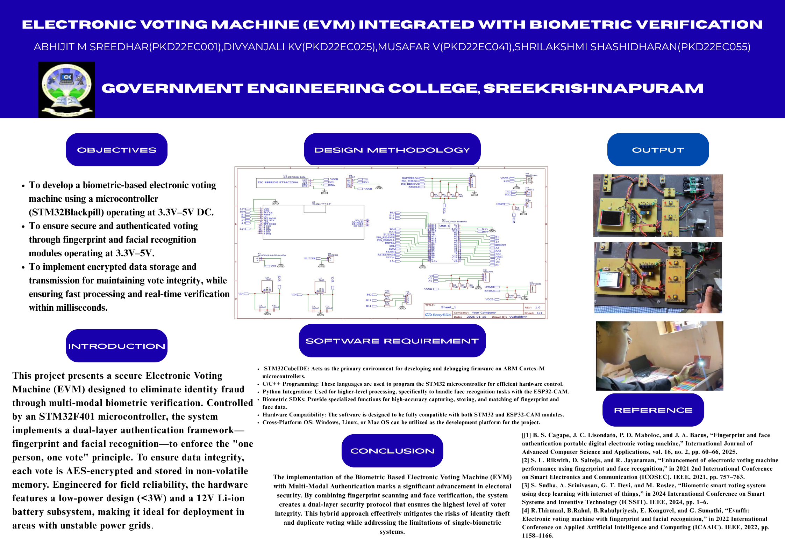

# ELECTRONIC-VOTING-MACHINE-INTEGRATED-WITH-BIOMETRIC-VERICATION
  This project aims to design, develop, and prototype a secure, reliable, and efficient Electronic Voting Machine (EVM) that integrates multi-modal biometric verification to fundamentally enhance the integrity of the electoral process by eliminating identity-based fraud such as duplicate and proxy voting. The system is architected around a high-performance STM32F401 microcontroller, which serves as the central processing unit to manage a duallayer authentication mechanism comprising a fingerprint sensor and a facial recognition module, ensuring that only authorized, registered voters can cast a single, legitimate vote. Following successful biometric verification, the voter is granted access to an intuitive voting interface, with confirmation provided via an OLED display. To guarantee data integrity and confidentiality, each cast vote is securely encrypted using the Advanced Encryption Standard (AES) algorithm before being stored in non-volatile memory, effectively preventing tampering and unauthorized access. Furthermore, the entire system is engineered for energy efficiency and operational robustness in field conditions, with a meticulously designed power supply subsystem based on a rechargeable 12V Li-ion battery and voltage regulation circuitry, maintaining total power consumption below 3 watts to facilitate deployment in areas with unstable grid power. By seamlessly merging robust hardware design with sophisticated software algorithms for biometric processing and cryptographic security, this project delivers a holistic voting solution that not only fortifies the principle of ”one person, one vote” but also sets a new benchmark for transparency, reliability, and trustworthiness in modern electronic electoral systems.

  

  
